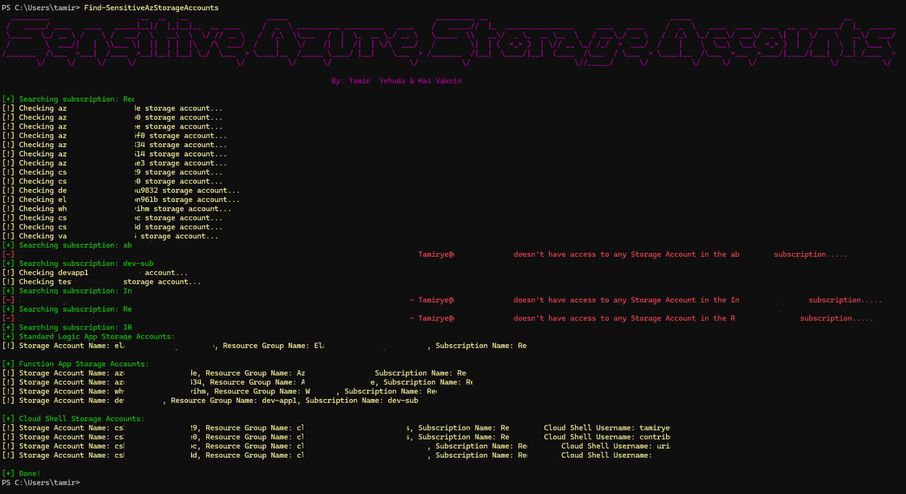

# Find-SensitiveAzStorageAccounts

## Overview

Find-SensitiveAzStorageAccounts is a PowerShell script designed to detect misconfigured Azure Storage Accounts that could potentially be exploited for privilege escalation and lateral movement. This script is particularly focused on Storage Accounts used by Azure Cloud Shell, Azure Function App, and Azure Logic App, as detailed in our blog post [here](https://medium.com/@tamirye94/not-the-access-you-asked-for-how-azure-storage-account-read-write-permissions-can-be-abused-75311103430f).

## Getting Started

1. **Prerequisites**

   - PowerShell 5.1 or higher
   - Azure Entra ID user with at least read permissions on all Azure Storage Accounts in the Azure environment.

2. **Usage**
   - Clone the repository to your local machine.
   - Load the modules `Import-Module .\Find-Sensitive-Azure-Storage-Accounts.ps1`
   - Run `Find-SensitiveAzStorageAccounts`
   - Follow the on-screen prompts to authenticate to Azure.
   - If Az module is not installed, you will be prompt to install it.
   - Wait while the script scan your environment :)

## Authors

- **Tamir Yehuda** - [Tamirye94](https://twitter.com/tamirye94)
- **Hai Vaknin** - [vakninhai](https://twitter.com/vakninhai)

## Disclaimer

This script is provided for educational purposes only.
